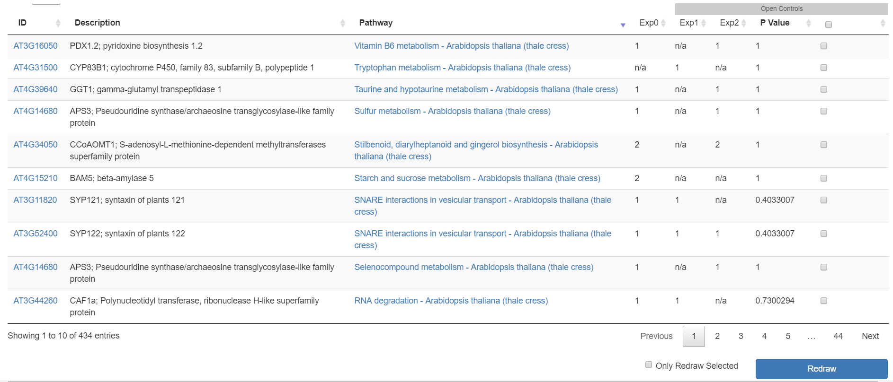

# About DiVenn
DiVenn: An interactive and integrated web-based tool for complex Venn diagrams

# Authors
- Liang Sun: lsun@noble.org
- Yinbing Ge: yinge@noble.org
- Zach Robinson: ztrobinson@noble.org

# Tutorial
> **Version 1.0**
 
## Introduction
Gene expression data generated from multiple biological states (mutant sample, double mutant sample and wild-type samples) are often compared via Venn diagram tools. It is of great interest to know the expression pattern between overlapping genes and their associated gene pathways or gene ontology terms. We developed DiVenn – a novel web-based tool that compares gene lists from multiple RNA-Seq experiments in a force directed graph, which shows the gene regulation levels for each gene and integrated KEGG pathway and gene ontology (GO) knowledge for the data visualization. DiVenn has three key features: (i) informative force-directed graph with gene expression levels to compare multiple data sets; (ii) interactive visualization with biological annotations and integrated pathway and GO databases, which can be used to subset or highlight gene nodes to pathway or GO terms of interest in the graph; and (iii) high resolution image and gene-associated information export.

*The current version is “1.0”.*

The application is freely available for Noble employees [here](http://10.84.2.163/index.php) (see Figure 1). 

 

 _**Figure 1.** Homepage of DiVenn_

## Browser requirements
All modern browsers, such as Safari, Google Chrome, and IE are supported. The recommended web browser to use is [Chrome](https://www.google.com/chrome/). 

## Introduction of DiVenn Interface
### 1.   Input Data

DiVenn currently accepts two types of input data (see Figure 2): 1) Two-column tab separated custom data. For example, gene ID and corresponding pathway data, transcription factors and their regulated downstream genes, microRNAs and corresponding target genes, and so forth. 2) Gene expression data. The first column is gene IDs and the second column is gene regulation value. The gene regulation value should be obtained from differentially expressed genes. Users can select the cut-off value of fold change (default is two-fold change) to define their differentially expressed (DE) genes. To simply this gene regulation value, we use “1” to represent up-regulated genes and “2” to represent down-regulated genes. If users need to link their genes to KEGG pathway (Kanehisa and Goto, 2000) or GO database, 14 model species are supported in DiVenn. Currently, three types of gene IDs : KEGG gene IDs, Uniprot gene IDs (UniProt, 2008) and NCBI gene IDs (Benson, et al., 2018), are accepted for pathway analysis. All agriGO (Du, et al., 2010; Tian, et al., 2017) supported IDs are supported for GO analysis by DiVenn ([View Table](image/tutorial/GO_table.md) or download in [Excel](image/tutorial/GO_version.xlsx)).

Please use the following sample data to test our tool: http://10.84.2.163/yge/data.html

_**Figure 2** Homepage of DiVenn_

### 2.   Visualization

 _**Figure 3** Force-directed graph in DiVenn_

### 3.	Click on the graph
Scroll the mouse on the graph will zoom in/out the graph.
Left clicking a node will show the connected edge colors, which will display the gene regulation status in each experiments. Double clicking the same node will hid the connect edge colors.
Right clicking a node can show five function options: show or hide one or all node labels; show all gene associated pathway or GO terms.

#### 3.1	Show and hide node label function
Right clicking nodes or edges can link out the genes or iTerms or gene:iTerm pairs of your interest to NCBI or eGIFT sentence databases (see Figure 4.1).

#### 3.2	Link to KEGG pathway and GO terms
If users need to check the KEGG pathway or GO terms of interested gene node, choose the ‘show gene detail’ option (see Figure 4.2(3)).

 

_**Figure 4.1** Right-click functions. Gene node names can be displayed and hidden; the detailed gene function including pathway and GO terms can be display through ‘Detail’ button._

_**Figure 4.2** Gene details. KEGG pathway and GO terms will be displayed by selecting gene detail option._

### 4.	GUI Function

#### Label Style
You can hide or show node labels. 

#### Color
You can change the color of all parent/experiment nodes in GUI (See Figure 2 xx).

#### Save
Graph can be saved as SVG image file via ‘Save as SVG’ function, SVG file will be downloaded in your local computer. This SVG file can be saved as high-resolution image via ‘SVG to PNG’ function.

#### Show pathway detail
You can show all gene-associated pathways by click this button and get the pathway informative table (See Figure 5.1).
All headline is sortable, the table is also searchable using key words of interest. If users need to sort gene list based on the pathway name, they can click on the headline of pathway column. If users need to multiple select genes from the same pathway after sorting the genes based on the same pathway, they can click the first checkbox and press shift keyboard to click the last checkbox, and redraw the selected genes to different shapes by clicking the “Redraw” button at the end of the table, or subset the genes into another new graph by click the “Only Redraw Selected” checkbox and “Redraw” button.
 

 

_**Figure 5.1** Pathway details of all associated genes in the force-directed graph._

#### Show gene ontology detail
You can show all gene-associated gene ontologies by click this button and get the gene ontology informative table (See Figure 5.2).
All headline is sortable, the table is also searchable using key words of interest. If users need to sort gene list based on the gene ontology name, they can click on the headline of pathway column. If users need to multiple select genes from the same pathway after sorting the genes based on the same gene ontology, they can click the first checkbox and press shift keyboard to click the last checkbox, and redraw the selected genes to different shapes by clicking the “Redraw” button at the end of the table, or subset the genes into another new graph by click the “Only Redraw Selected” checkbox and “Redraw” button.

_**Figure 5.2** Gene ontology details of all associated genes in the force-directed graph._

