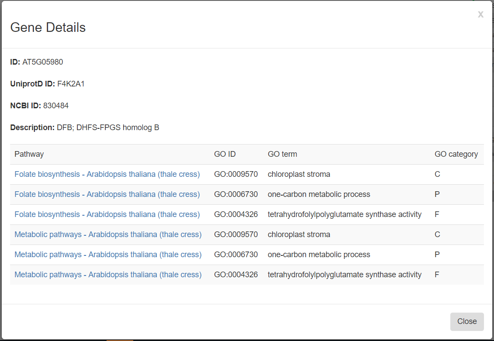

# About DiVenn
DiVenn: An interactive and integrated web-based tool for complex Venn diagrams

# Authors
- Liang Sun: lsun@noble.org
- Yinbing Ge: yinge@noble.org
- Zach Robinson: ztrobinson@noble.org

# Tutorial
> **Version 1.0**
 
## Introduction
Gene expression data generated from multiple biological states (mutant sample, double mutant sample and wild-type samples) are often compared via Venn diagram tools. It is of great interest to know the expression pattern between overlapping genes and their associated gene pathways or gene ontology terms. We developed DiVenn – a novel web-based tool that compares gene lists from multiple RNA-Seq experiments in a force directed graph, which shows the gene regulation levels for each gene and integrated KEGG pathway and gene ontology (GO) knowledge for the data visualization. DiVenn has three key features: (i) informative force-directed graph with gene expression levels to compare multiple data sets; (ii) interactive visualization with biological annotations and integrated pathway and GO databases, which can be used to subset or highlight gene nodes to pathway or GO terms of interest in the graph; and (iii) high resolution image and gene-associated information export.

*The current version is “1.0”.*

The application is freely available (see Figure 1). 

 

 _**Figure 1.** Homepage of DiVenn_

## Browser requirements
All modern browsers, such as Safari, Google Chrome, and IE are supported. The recommended web browser is [Chrome](https://www.google.com/chrome/). 

## Introduction of DiVenn Interface
### 1.   Input Data

DiVenn currently accepts two types of input data (see Figure 2): 1) Two-column tab separated custom data. For example, gene ID and corresponding pathway data, transcription factors and their regulated downstream genes, and microRNAs and corresponding target genes. 2) Gene expression data. The first column is gene IDs and the second column is gene regulation value. The gene regulation value should be obtained from differentially expressed (DE) genes. Users can select the cut-off value of fold change (default is two-fold change) to define their DE genes. To simplify this gene regulation value, we use “1” to represent up-regulated genes and “2” to represent down-regulated genes. If users need to link their genes to the KEGG pathway (Kanehisa and Goto, 2000) or GO database, 14 model species are supported in DiVenn. Currently, three types of gene IDs : KEGG, Uniprot (UniProt, 2008) and NCBI (Benson, et al., 2018), are accepted for pathway analysis. All agriGO (Du, et al., 2010; Tian, et al., 2017) supported IDs are supported for GO analysis by DiVenn ([View table](image/tutorial/GO_table.md) or download in [Excel](image/tutorial/GO_version.xlsx)).

Please use the following sample data to test our tool: http://divenn.noble.org/data.html

_**Figure 2** Flow chart of DiVenn_

### 2.   Visualization

 _**Figure 3** Force-directed graph in DiVenn_

### 3.	Click on the Graph
Scrolling with the mouse wheel on the graph will zoom into/out of the graph.

Left-clicking a node will show the connected edge colors, which will display the gene regulation status for each experiment. Double-clicking the same node will hide the connecting edge colors.

Right-clicking a node will show five function options: show or hide one or all node labels, show all gene associated pathways, or GO terms.

#### 3.1	Show and hide node label function
Right-clicking nodes can show the gene IDs of interest (see Figure 4.1).

#### 3.2	Link to KEGG pathway and GO terms
If users need to check the KEGG pathway or GO terms of interested gene node, they choose the ‘show gene details’ option after right clicking the node (see Figure 4.2).

 

_**Figure 4.1** Right-click functions. Gene node names can be displayed and hidden; the detailed gene function, including pathway and GO terms, can be displayed through ‘Details’ button._

_**Figure 4.2** Gene details. KEGG pathway and GO terms will be displayed by selecting "Gene pathway details" or "Gene ontology details" option._

### 4.	GUI Function

#### Label Style
You can hide or show node labels. 

#### Color
You can change the color of all parent/experiment nodes in GUI (see Figure 3).

#### Save
Graph can be saved as an SVG image file via the "Save as SVG" function, and the SVG file can be downloaded to your local computer. This SVG file can be converted to a high-resolution image using free online tools.

#### Show Pathway Detail
You can show all gene-associated pathways by clicking this button and get the pathway informative table (see Figure 5.1).

The column headers on the informative table are sortable; the table is also searchable with key words of interest. If users need to sort a gene list based on the pathway name, they can click on the “Pathway” column header. If users need to select multiple genes from the same pathway after sorting the genes based on pathway, they can click the first checkbox and press shift before clicking the last checkbox. They can redraw the selected genes to different shapes by clicking the “Redraw” button at the end of the table or subset the genes into another new graph by clicking the “Only Redraw Selected” checkbox and the “Redraw” button.
 

 

_**Figure 5.1** Pathway details of all associated genes in the force-directed graph._

#### Show Gene Ontology Detail
You can show all gene-associated gene ontologies by clicking this button to get the gene ontology informative table (see Figure 5.2).

The column headers on the informative table are sortable; the table is also searchable with key words of interest. If users need to sort the gene list based on the gene ontology name, they can click on the “GO term” column header. If users need to select multiple genes from the same GO terms after sorting the genes based on GO terms, they can click the first checkbox and press shift before clicking the last checkbox. They can redraw the selected genes to different shapes by clicking the “Redraw” button at the end of the table or subset the genes into another new graph by clicking the “Only Redraw Selected” checkbox and the “Redraw” button.

_**Figure 5.2** Gene ontology details of all associated genes in the force-directed graph._

