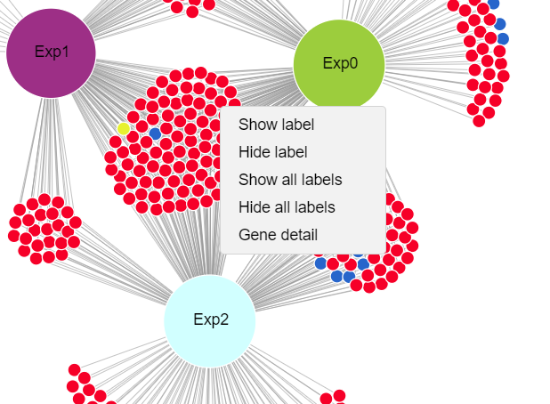

# About DiVenn
DiVenn: An interactive and integrated web-based tool for complex Venn diagrams

Test image:

>>>>>>>>>>>>>>>>>>>>>>>>>>>>>>>>>>>>>>>>>>>>>>>>>>>>>>>>>>>>>>>>>>>>>>

DiVenn
Version 1.0
# Tutorial
###### Version 1.0

##### Authors
- Liang Sun: lsun@noble.org
- Yinbing Ge: yinge@noble.org
- Zach Robinson: ztrobinson@noble.org

 
## Introduction
Gene expression data generated from multiple biological states (mutant sample, double mutant sample and wild-type samples) are often compared via Venn diagram tools. It is of great interest to know the expression pattern between overlapping genes and their associated gene pathways or gene ontology terms. We developed DiVenn – a novel web-based tool that compares gene lists from multiple RNA-Seq experiments in a force directed graph, which shows the gene regulation levels for each gene and integrated KEGG pathway knowledge for the data visualization. DiVenn has three key features: (i) informative force-directed graph with gene expression levels to compare multiple data sets; (ii) interactive visualization with biological annotations and integrated pathway databases, which can be used to aggregate gene nodes to pathway nodes in the graph; and (iii) high resolution image and gene-associated information export.

The current version is “1.0”. 
It is freely available at http://10.84.2.163/index.php (see Figure 1). 

 

 Figure 1. Homepage of DiVenn

## Brower requirements
All modern browsers, such as Safari, Google Chrome, and IE are supported. The recommended web browser to use is Chrome. 

## Introduction of DiVenn Interface
### 1.   Input Data

DiVenn currently accepts two types of input data: 1) Two-column tab separated custom data. For example, gene ID and corresponding pathway data, transcription factors and their regulated downstream genes, microRNAs and corresponding target genes, and so forth. 2) Gene expression data. The first column is gene IDs and the second column is gene expression value. The gene expression value should be either Reads Per Kilobase Million (RPKM) or Fragments Per Kilobase Million (FPKM). Users can select the cut-off value of fold change (default is two-fold change) to define their differentially expressed (DE) genes. Currently, three types of gene IDs : KEGG gene ID, Uniprot gene ID  and NCBI gene ID, are accepted for pathway analysis and all agriGO  supported ID for GO analysis by DiVenn (See table in excel:GO_supported_ID.xlsx).

### 2.   Visualization

 
Figure 2 Force-directed graph in DiVenn.

### 3.	Click on the graph

Right clicking nodes can show five function options: show or hide one or all node labels; show all gene associated pathway or GO terms.

#### 3.1	Show and hide node label function
Right clicking nodes or edges can link out the genes or iTerms or gene:iTerm pairs of your interest to NCBI or eGIFT sentence databases (see Figure 3.1).

#### 3.2	Link to KEGG pathway and GO terms

If users need to check the KEGG pathway or GO terms of interested gene node, choose the ‘show gene detail’ option (see Figure 3.2(3)).

 

_**Figure 3.1** Right-click functions. Gene node names can be displayed and hidden; the detailed gene function including pathway and GO terms can be display through ‘Detail’ button._

_**Figure 3.2** Gene details. KEGG pathway and GO terms will be displayed by selecting gene detail option._

### 4.	GUI Function

-	Label Style

You can hide or show node labels. 

-	Color

You can change the color of all parent/experiment nodes in GUI (See Figure 2 xx).

-	Save

Graph can be saved as SVG image file via ‘Save as SVG’ function, SVG file will be downloaded in your local computer. This SVG file can be saved as high-resolution image via ‘SVG to PNG’ function. 

-	Show pathway detail

You can show all gene-associated pathways by click this button.
 

_**Figure 4.1** Pathway details of all associated genes in the force-directed graph._

-	Show gene ontology detail

You can show all gene-associated gene ontologies by click this button.

